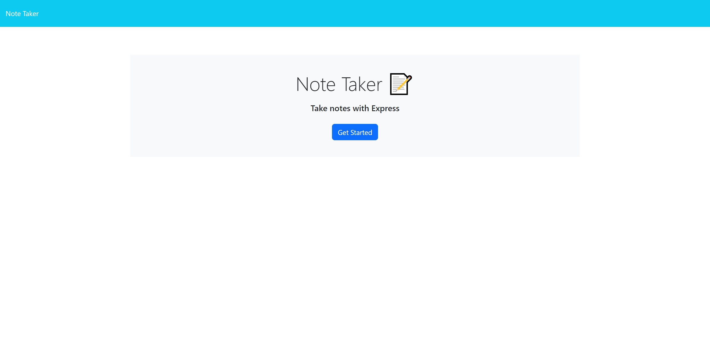
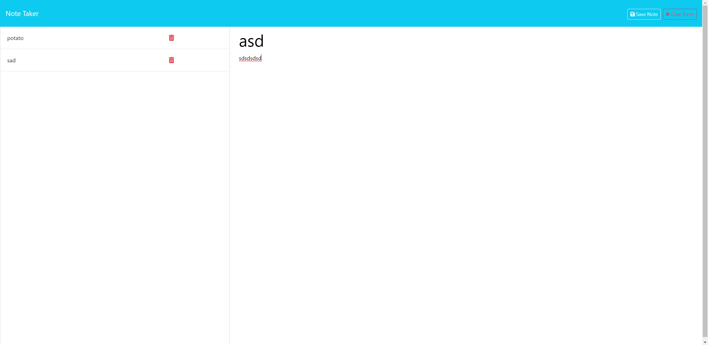

# Challenge 11: Note Taker

## Description

This project is a webpage that is displaying a note taker. The project consists of a homepage, that the user can click into the notes page. When in the notes page, the user can input a title and text, and save or clear that note. If the user wants to save the note, they will click save note, and the notes will show on the left side bar. Click a trash can will delete that note.

## Installation

To install the project, clone the repository onto your PC. Make sure to have Node.JS installed. The repository should have express package installed already, but if it is not, run the command "npm install"
Enter the directory that has the cloned repository and type "node server.js"

To access the webpage, click the link below:

https://floating-fortress-84891-ba6e7b5ee5a9.herokuapp.com/

## Usage

To start, click the blue "Get Started" button. This will send you to the notes page. From here, the user can type into the Note Title and Not Text, once there is text in both of these, a Clear Form button and Save Note button will appear in the top right. Clear Form will clear the input data, and Save Note will save the note to the sidebar. If you want to delete a note from the sidebar, click the trash can icon.

## License

MIT License

Copyright (c) [year] [fullname]

Permission is hereby granted, free of charge, to any person obtaining a copy
of this software and associated documentation files (the "Software"), to deal
in the Software without restriction, including without limitation the rights
to use, copy, modify, merge, publish, distribute, sublicense, and/or sell
copies of the Software, and to permit persons to whom the Software is
furnished to do so, subject to the following conditions:

The above copyright notice and this permission notice shall be included in all
copies or substantial portions of the Software.

THE SOFTWARE IS PROVIDED "AS IS", WITHOUT WARRANTY OF ANY KIND, EXPRESS OR
IMPLIED, INCLUDING BUT NOT LIMITED TO THE WARRANTIES OF MERCHANTABILITY,
FITNESS FOR A PARTICULAR PURPOSE AND NONINFRINGEMENT. IN NO EVENT SHALL THE
AUTHORS OR COPYRIGHT HOLDERS BE LIABLE FOR ANY CLAIM, DAMAGES OR OTHER
LIABILITY, WHETHER IN AN ACTION OF CONTRACT, TORT OR OTHERWISE, ARISING FROM,
OUT OF OR IN CONNECTION WITH THE SOFTWARE OR THE USE OR OTHER DEALINGS IN THE
SOFTWARE.
